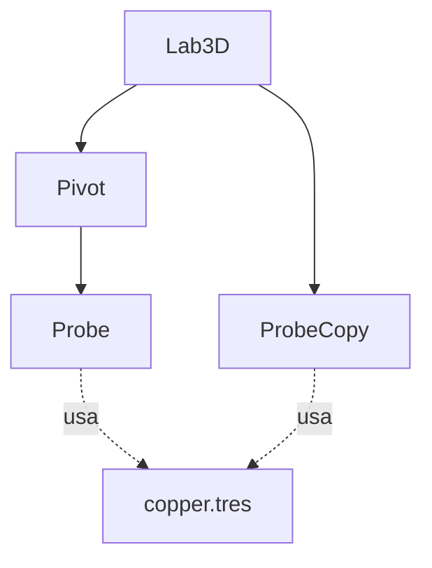

# Ejemplos guiados · Motor Lab

Abre una copia del starter con Godot 4.7.2. Guarda baseline, predice, cambia una variable, ejecuta y compara. Las cifras siguientes son resultados calculados del caso, contrastables con el motor; no sustituyen tu observación del editor.

## 1. Giro heredado sin mover la posición local

Abre scenes/lab3d.tscn y detén el giro si estaba activo. Selecciona Pivot: posición (2,0,0), rotación inicial cero. Selecciona Probe: posición local (1,1,0). Calcula global (3,1,0). Cambia solo rotación Y de Pivot a 90 grados en Inspector; ejecuta. La predicción es global (2,1,-1), con local intacta. Comprueba el texto de estado y la jerarquía remota durante ejecución. Restablece desde copia o devuelve rotación a cero.

Error discriminante: escribir 90 directamente en la propiedad rotation de un .tscn, que almacena radianes, no equivale a 90 grados. La solución de referencia usa 1.5707963267948966 radianes. El Inspector puede presentar grados: distingue interfaz de almacenamiento. Explica por qué ProbeCopy no sigue el giro; no es hijo de Pivot.

## 2. Recurso compartido y parentesco son mapas distintos

Selecciona material_override de Probe y ProbeCopy; ambos usan materials/copper.tres. Modifica roughness de 0.2 a 0.8 y conserva el resto. Observa ambas superficies con la misma cámara y luz; registra si el efecto es visible en tu entorno. El motor puede comprobar que ambos nodos referencian el mismo recurso aunque el test headless no observe brillo. Restaura y, solo en una copia de ensayo, crea un material único para ProbeCopy y cambia su color: explica por qué deja de propagarse esa edición.

Equivalente textual: Lab3D contiene Pivot y ProbeCopy; Pivot contiene Probe; Probe y ProbeCopy usan copper.tres. Las flechas de contención no significan dependencia de archivo. Adjunta tabla equivalente si tu plataforma no renderiza el diagrama.

## 3. Detección sin sostener el cuerpo

Ejecuta lab3d: SampleBody cae y queda sobre Platform; Sensor registra entrada. Predice el cambio si la máscara del Sensor pasa de capa 2 a ninguna: la bola seguirá cayendo/colisionando con suelo, pero no llegará el evento. Realiza el experimento en copia, registra y restaura. No cambies a la vez máscara del cuerpo o forma del suelo.

Resultado esperado por estructura: detección y contacto son responsabilidades distintas. Error frecuente: borrar la forma de Platform para “arreglar” un evento ausente, destruyendo un comportamiento que funcionaba. Comprobación: identifica qué nodo tiene malla, cuál forma y cuál recibe señal. El valor temporal exacto del contacto puede variar; no lo uses como promesa física de hardware.

## 4. Analizar un juego terminado

Abre “Analizar minijuego existente”. Inicia y pulsa A-B-A: estado WON, contador 3/3. Pulsa otra tecla: no debe avanzar ni fallar por índice. Inicia otra ronda y pulsa B primero: LOST. Inicia otra y deja transcurrir el límite: LOST por tiempo. Localiza choose, _process y _update_view en signal_game.gd. Dibuja estados y anota quién produce cada transición.

Resultado razonado: las entradas fuera de PLAY se ignoran; reinicio restablece step y tiempo. El tono es feedback redundante con texto/contador. No se pide reescribir el juego ni añadir niveles; el objetivo es identificar bloques funcionales y límites. En headless se comprobaron reglas y recurso de audio; escuchar corresponde al entorno real.

## 5. Selección con evidencia que no exagera

Entrada: juego móvil pequeño para PM9, geometría sencilla, equipo docente heterogéneo y cero assets de pago. Escribe una fila Godot: versión exacta disponible, proyecto GDScript ejecutable, nodos/escenas y Compatibility; añade observación de tu equipo si la tienes. Fila Unity: referencia documental de GameObject/componentes y política LTS; marca NO_EJECUTADO si no lo has usado.

Conclusión razonada: Godot es el motor aprobado y la evidencia del laboratorio permite continuar con ese alcance; Android requerirá templates/SDK/JDK y QA en PM9. No concluyas que supera a Unity en FPS desde un laboratorio que solo ejecutó Godot. Error frecuente: puntuar rendimiento 10/10 sin carga ni medición. Una limitación explícita mejora la decisión, no invalida automáticamente la elección.
