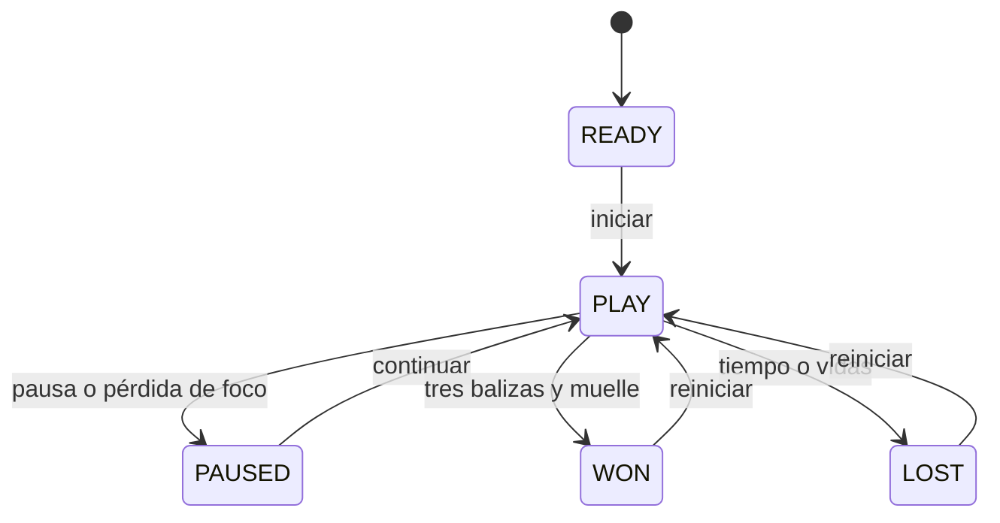

# Contrato didáctico del juego · Balizas del muelle

Datos originales de entrenamiento, sin contrato AulaFlow ni AulaTokens. Mundo 3D acotado a 12×12 unidades; juego individual local y orientación paisaje. Objetivo: recoger CELL-A/B/C y entrar al muelle antes de 60 s conservando al menos una vida. Tres vidas iniciales; cada impacto aceptado resta una y da 1.2 s de inmunidad; respawn seguro conserva recogidas y tiempo restante. Pausa conserva datos y detiene movimiento/tiempo. Reiniciar restablece ronda completa.

| Objeto | Tipo/posición de referencia | Función y condición |
|---|---|---|
| Player | CharacterBody3D, (-4,0.7,4), velocidad 4.5 | Movimiento XZ, gravedad 18, colisión con recinto |
| CellA | Area3D, (-4,0.9,-3), CELL-A | Recogida única |
| CellB | Instancia nueva, (3,0.9,-4), CELL-B | Recogida única |
| CellC | Instancia nueva, (4,0.9,3), CELL-C | Recogida única |
| ConeA / ConeB | Area3D, (0,0.6,0) y (2,0.6,2) | Peligros de contacto, forma distinta a baliza |
| Muelle | Area3D, (0,0.75,4.5) | Entrega solo con tres IDs |
| Suelo/paredes | StaticBody3D, capa 1 | Recinto sólido; Player capa 2/máscara 1 |
| Camera / Sun | Ortogonal y direccional + ambiente | Encuadre/lectura del espacio |
| HUD / Tone | UI y AudioStreamPlayer | Estado, progreso, controles y feedback redundante |

Equivalente textual: READY inicia PLAY; PLAY puede pausarse/reanudarse; entrega completa gana, tiempo/vidas pierden; finales solo vuelven a PLAY mediante reinicio. También se permite reiniciar una ronda en curso. Inputs y eventos no producen progreso fuera de PLAY.

No objetivos: multijugador, backend, anuncios, compras, persistencia, publicación de tienda, modelado avanzado o niveles ilimitados. Se permite variar aspecto de recursos originales manteniendo significado, contraste y reglas; registra cambios. Si cambias una regla del contrato de práctica, acuerda y documenta la variante, no debilites aceptación para acomodar un bug.

Condiciones técnicas: Godot 4.7.2, Compatibility, fuente reproducible, recursos/avisos documentados, pruebas pertinentes, APK debug y evidencia de implantación real cuando haya oportunidad. La calificación se decide por RA5.a–j y autenticidad, no por esta tabla como lista automática de nota.
